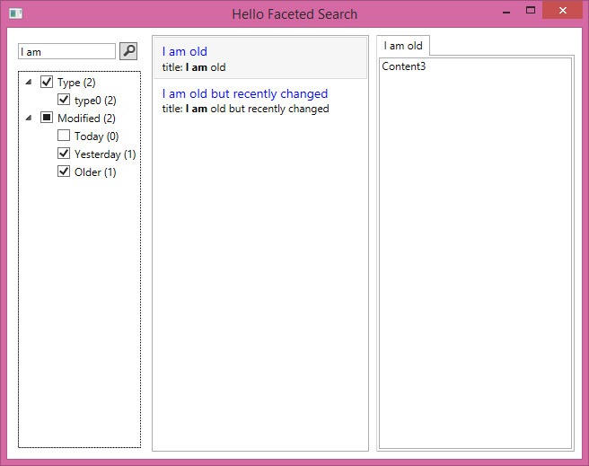

# hello.elastic.facetedSearch.wpf

An quick sample on how to build faceted search navigation and highlighting for Elasticsearch using WPF.

## How to build

1. Have a local elasticsearch instance running. If you haven't, goto [Elasticsearch](https://www.elastic.co/downloads/elasticsearch)
2. Open [hello.elastic.facetedSearch.wpf.sln](hello.elastic.facetedSearch.wpf.sln) with Visual Studio and run the sample app `HelloFacets` 

